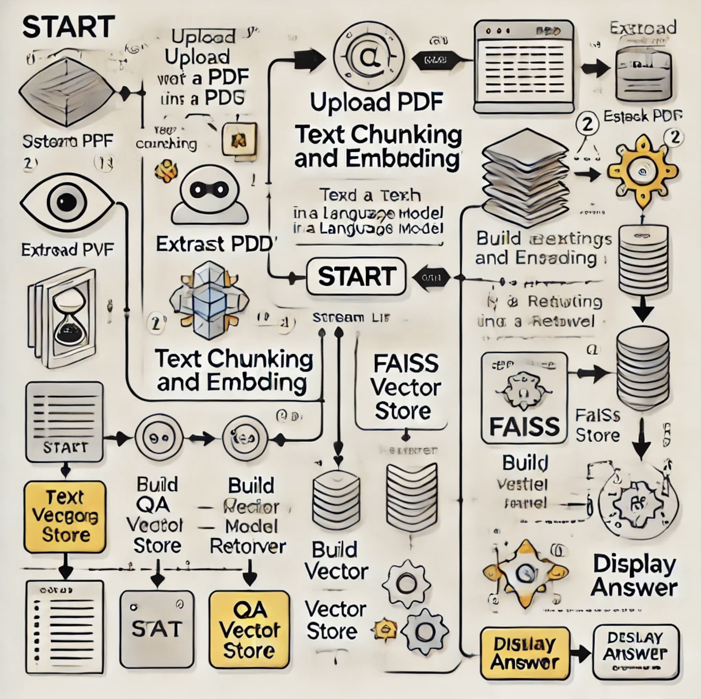

# Local RAG Chatbot with PDF

## Table of Contents
1. Introduction
2. Present the System Engineering Flowchart Process
3. Installation
4. Usage
5. Functions
    - extract_text_from_pdf
    - create_faiss_vector_store
    - load_faiss_vector_store
    - build_qa_chain
6. [Streamlit Interface](#streamlit-interface)

## Introduction
The "Local RAG Chatbot with PDF" project allows users to upload a PDF file and ask questions based on the content of the PDF. The chatbot uses a Retrieval-Augmented Generation (RAG) approach to provide answers by leveraging a FAISS vector store and a language model.

## Present the System Engineering Flowchart Process
Here’s a system engineering flowchart process for the "Local RAG Chatbot with PDF" based on the README description. It outlines the key steps and components in the system:

### **System Engineering Flowchart Process**

1. **Start**  
   - User accesses the Streamlit interface.

2. **Upload PDF**  
   - User uploads a PDF file through the file uploader.

3. **Extract Text**  
   - System uses `extract_text_from_pdf` to parse and extract text from the uploaded PDF.

4. **Text Chunking and Embedding**  
   - System splits the extracted text into chunks using `RecursiveCharacterTextSplitter`.  
   - Embeddings are generated for each chunk using the `HuggingFaceEmbeddings` model.

5. **FAISS Vector Store**  
   - **Create Vector Store**:  
     - System stores the embeddings into a FAISS vector store via `create_faiss_vector_store`.  
   - **Load Vector Store**:  
     - On subsequent usage, the system loads the vector store with `load_faiss_vector_store`.

6. **Build QA Chain**  
   - FAISS vector store is converted into a retriever.  
   - The system initializes the language model (Ollama, e.g., llama3.2:3b).  
   - The retriever and language model are combined to form a RetrievalQA chain via `build_qa_chain`.

7. **Ask Questions**  
   - User inputs a question via the Streamlit interface.  
   - The system processes the query using the QA chain to retrieve relevant text and generate an answer.

8. **Display Answer**  
   - The chatbot's response is displayed to the user.

9. **End**  
   - User can upload another PDF or ask additional questions.

Attached is an exhibition of flowchart as a visual diagram below:


## Installation
To install the necessary dependencies, run:
```sh
pip install streamlit PyPDF2 langchain sentence-transformers faiss-cpu ollama 
pip install -U langchain-community
```

## Usage
To run the application, use the following command:
```sh
streamlit run app.py
```
This will start a Streamlit web application where you can upload a PDF and interact with the chatbot.

## Functions

### extract_text_from_pdf
```python
def extract_text_from_pdf(pdf_path):
    reader = PdfReader(pdf_path)
    text = ""
    for page in reader.pages:
        text += page.extract_text()
    return text
```
This function takes the path of a PDF file as input and extracts the text from each page of the PDF. It returns the extracted text as a single string.

### create_faiss_vector_store
```python
def create_faiss_vector_store(text, path="faiss_index"):
    splitter = RecursiveCharacterTextSplitter(chunk_size=1000, chunk_overlap=200)
    chunks = splitter.split_text(text)
    
    embeddings = HuggingFaceEmbeddings(model_name="sentence-transformers/all-MiniLM-L6-v2") 
    vector_store = FAISS.from_texts(chunks, embedding=embeddings)
    vector_store.save_local(path)
```
This function creates a FAISS vector store from the provided text. It splits the text into chunks, generates embeddings for each chunk, and saves the vector store locally.

### load_faiss_vector_store
```python
def load_faiss_vector_store(path="faiss_index"):
    embeddings = HuggingFaceEmbeddings(model_name="sentence-transformers/all-MiniLM-L6-v2")  
    vector_store = FAISS.load_local(path, embeddings, allow_dangerous_deserialization=True)
    return vector_store
```
This function loads a previously saved FAISS vector store from the specified path. It uses the same embeddings model to ensure consistency.

### build_qa_chain
```python
def build_qa_chain(vector_store_path="faiss_index"):
    vector_store = load_faiss_vector_store(vector_store_path)
    retriever = vector_store.as_retriever()
    llm = Ollama(model="llama3.2:3b")
    qa_chain = load_qa_chain(llm, chain_type="stuff")
    qa_chain = RetrievalQA(retriever=retriever, combine_documents_chain=qa_chain)
    return qa_chain
```
This function builds the QA chain by loading the FAISS vector store, creating a retriever, and initializing the language model. It combines these components into a RetrievalQA chain.

## Streamlit Interface
The Streamlit interface allows users to interact with the chatbot through a web application. The main components are:

- **Title and Description**: Displays the title and a brief description of the application.
- **File Uploader**: Allows users to upload a PDF file.
- **PDF Processing**: Extracts text from the uploaded PDF, creates a FAISS vector store, and initializes the chatbot.
- **Question Input**: Provides an input box for users to ask questions about the uploaded PDF.
- **Answer Display**: Displays the chatbot's response to the user's question.

To start the Streamlit application, run:
```sh
streamlit run app.py
```